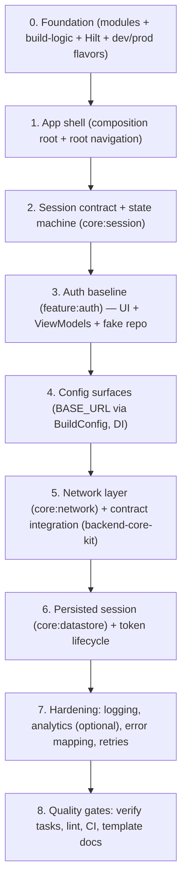

# AndroidCoreKit — End-to-End Backlog (WIP)

This is the execution backlog for turning this repo into a **clone-per-app starter template** with a stable baseline auth feature.

> Principle: ship foundations first, then add capabilities behind stable contracts (core/session, core/navigation).

## Big-picture map (dependency order)

## Backlog (phases + deliverables)

### 0) Foundation (must be boring + stable)

Deliverables:

- Multi-module skeleton aligned with `docs/android-architecture-guide.md`.
- `build-logic` convention plugins to eliminate Gradle copy/paste.
- Hilt wiring baseline (app as composition root; module-level DI bindings).
- Flavors: `dev` and `prod` only.
  - `applicationIdSuffix` for `dev` only.
  - `BuildConfig.BASE_URL` set per flavor (placeholder values for now).
- “Windows git in WSL” wrapper available: `tool/agent/gitw --no-stdin`.

Exit criteria:

- `./gradlew :app:assembleDevDebug` and `./gradlew :app:assembleProdDebug` succeed.
- Minimal `:core:*` modules compile and are dependency-correct.

### 1) App shell (composition root)

Deliverables:

- `MainActivity` moved to `:app` and sets up app theme + root nav host.
- Root graph switch:
  - `UnauthenticatedRoot` → auth graph
  - `AuthenticatedRoot` → stub main graph
- Navigation contracts live in `:core:navigation` (graph-level destinations only).

Exit criteria:

- App launches into auth flow when unauthenticated.
- After “fake login”, navigates to authenticated root.

### 2) Session contract (core:session)

Deliverables:

- `SessionState` model and `SessionManager` interface.
- In-memory implementation for starter (persisted impl later).
- Clear rules for what “authenticated” means (minimal boolean initially).

Exit criteria:

- Any feature can react to session state without depending on `:feature:auth`.

### 3) Auth baseline (feature:auth, backend-agnostic)

Deliverables:

- Screens + ViewModels for:
  - login
  - register
  - forgot password
  - email confirmation
  - logout
- Repository contracts + fake implementation to unblock UX and navigation.
- Form validation conventions (minimal; backend rules later).

Exit criteria:

- Auth flows are navigable end-to-end without backend integration.

### 4) Config surfaces (dev/prod)

Deliverables:

- Base URL is consumed via DI (single source of truth, injected into networking later).
- Only these differences exist between envs (for now):
  - `applicationIdSuffix` (dev only)
  - `BuildConfig.BASE_URL`

Exit criteria:

- No environment-specific branching scattered in app code.

### 5) Network layer + backend contract integration

Deliverables:

- Add `:core:network` with Retrofit/OkHttp + JSON configuration.
- Align request/response DTOs and error semantics with backend contracts.
- Start integrating auth endpoints using `/mnt/c/Development/_CORE/backend-core-kit`.

Exit criteria:

- Auth uses real backend calls (behind repository interface), without breaking UI contracts.

### 6) Persisted session + token lifecycle

Deliverables:

- Add `:core:datastore` to persist session/token (refresh strategy later once contract is known).
- Session restoration on app start.
- Logout clears persisted state.

Exit criteria:

- App survives process death and restores auth state correctly.

### 7) Hardening (optional but likely)

Deliverables (as needed per app):

- Logging abstraction (`:core:logging`) + default impl in `:app`.
- Analytics abstraction (`:core:analytics`) + default impl in `:app`.
- Error mapping standardization (`AppError`), retry/backoff policies, offline handling.

Exit criteria:

- Clear, consistent error behavior across features.

### 8) Quality gates + template docs

Deliverables:

- A single “verify” command (Gradle task) to run:
  - unit tests
  - lint
  - formatting/static analysis (decide tools)
- Minimal CI pipeline doc.
- Template checklist: “what to change when cloning”.

Exit criteria:

- New clones are low-effort to bootstrap and hard to break.

## References

- Backend contracts: `/mnt/c/Development/_CORE/backend-core-kit`
- Flutter reference implementation: `/mnt/c/Development/_CORE/mobile-core-kit`

