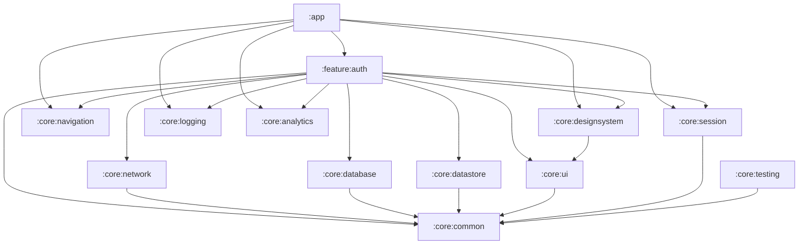

## 1) Architecture overview

### Template intent (clone-per-app)

This guide assumes **AndroidCoreKit is cloned per app** (not consumed as a shared library). The goal is to provide:

* **Stable, always-present foundations** (`:core:*` contracts + `:feature:auth` baseline)
* **Clear boundaries that scale** (feature isolation, dependency direction, `:app` as composition root)
* **Low-ceremony defaults** (patterns are consistent, but only enforced when they pay off)

In particular:

* `domain/` is **optional-by-default** for most features.
* `UseCase` classes are **not mandatory** for simple flows (ViewModel → Repository is fine).
* Authentication/session is a special case: it tends to be orchestration-heavy, so the template can be more structured there.

### Layers (MVVM, Compose-first)

**Presentation (feature `presentation/`)**

* **Compose UI** (`Screen`, `Route`, reusable `@Composable`s)

  * Renders **persistent UI state** (`UiState`)
  * Sends **user intents** (`UiEvent`) to the ViewModel
  * Collects **one-off effects** (`UiEffect`) for navigation/snackbar/toast
* **ViewModel**

  * Owns a single `StateFlow<UiState>` as the source of truth for the screen
  * Exposes a `SharedFlow<UiEffect>` for one-time side effects
  * Executes business logic (**direct repository calls or use-cases**) and updates state

**Domain (feature `domain/`, optional-by-default)**

* **UseCases (optional)**

  * Small, focused business operations (e.g., `LoginUseCase`)
  * Use when you need orchestration, reuse, or non-trivial rules
* **Repository interfaces**

  * Defined here to keep domain independent of frameworks and implementations
* **Domain models**

  * Types that represent business concepts (not DTOs / not Room entities)

**Data (feature `data/`)**

* **Repository implementations**

  * Implement domain repository interfaces
  * Combine remote + local data sources, caching, mapping, error handling
* **Data sources**

  * `remote/` (Retrofit services, DTOs)
  * `local/` (Room DAOs/entities, DataStore)
* **Mappers**

  * DTO ↔ domain, Entity ↔ domain conversions live here (near the boundary)

### Dependency rules (what can import what)

**Rule of thumb: dependencies flow inward.**

* `presentation` can depend on `domain` and shared `:core:*` UI/util modules.
* `domain` depends only on:

  * Kotlin stdlib
  * `:core:common` (Result/Error wrappers, dispatchers, etc.) if desired
* `data` depends on:

  * `domain` (to implement repository interfaces)
  * shared infra modules (`:core:network`, `:core:database`, `:core:datastore`)
* `:app` depends on:

  * all `:feature:*` modules
  * shared `:core:*` modules
  * platform-only implementations (analytics/logging actuals)

**Hard rule: a feature module must not import another feature module.**

* Shared types/behavior go into `:core:*` (or a small contract module if truly needed).
* Navigation between features is done via **navigation contracts** in `:core:navigation` (details below).

### Persistent UI state vs one-off effects

**Persistent UI state (`UiState`)**

* Stored in `StateFlow`
* Contains everything needed to render the UI
* Survives recomposition
* Examples: input text, loading flags, validation errors, loaded data

**One-off effects (`UiEffect`)**

* Emitted via `SharedFlow` (or `Channel` converted to flow)
* Not re-rendered; handled once by the UI layer
* Examples: navigation, snackbars/toasts, opening a URL, "scroll to top"

**Pattern**

* UI sends `UiEvent` → ViewModel handles it
* ViewModel updates `UiState` and emits `UiEffect` when needed
* UI collects:

  * `uiState` using `collectAsStateWithLifecycle()`
  * `effects` inside `LaunchedEffect(Unit)`

---

## 2) Module plan (scales without overengineering)

Start with a **multi-module "core + feature"** structure:

### Baseline modules (always present in every app clone)

**`:app`**

* Android application module
* Composes feature navigation graphs and provides platform implementations
* Owns:

  * `MainActivity`, top-level `NavHost`
  * app-wide DI bindings (analytics/logging impl, crash reporting, etc.)
  * build variants, app icon, manifest

**`:core:*` (stable contracts; keep the default set small)**

Recommended baseline:

* `:core:common`

  * Result/error wrappers, dispatcher provider, small utilities
  * No Android UI dependencies if possible (keep it mostly pure Kotlin)
* `:core:ui`

  * Shared UI primitives (e.g., `UiText`, loading/error content)
* `:core:designsystem`

  * Compose theme, typography, colors, shapes, reusable components
* `:core:navigation`

  * Navigation contracts (`Destination`), route builders, shared nav helpers
  * Prefer graph-level destinations for cross-feature transitions (e.g., `AuthenticatedRoot`, `UnauthenticatedRoot`)
* `:core:session`

  * App-wide session/auth state contract (no backend details)
  * Exposes `SessionState`/`isAuthenticated` and `logout()`-style APIs
* `:core:testing`

  * Test utilities (coroutines rules, fakes, common fixtures)

Optional (add when needed):
* `:core:network`

  * Retrofit/OkHttp setup, interceptors, Json config
* `:core:database`

  * Room `AppDatabase`, shared DAOs/entities (only if truly shared)
* `:core:datastore`

  * DataStore wrappers (session/preferences), keys, serializers
* `:core:logging` / `:core:analytics`

  * Interfaces (and optional default implementations in `:app`)

**`:feature:*` (one module per feature)**

Always-present baseline:

* `:feature:auth` (**login**, **register**, **forgot password**, **email confirmation**, **logout**)

App-specific modules:

* `:feature:<name>` (created per app as needed)

Each feature module is a vertical slice with internal packages:

* `presentation/` (Compose + ViewModel)
* `domain/` (**optional**) (use-cases + repo interfaces + domain models)
* `data/` (repo impl + sources + DTO/entity + mapping)
* `di/` (Hilt module bindings for that feature)

### DI (Hilt) rules

* Standardize on Hilt across modules.
* Each module contributes bindings via `@Module` + `@InstallIn(...)`.
* `:app` is the composition root and owns platform-only implementations/overrides.

### UseCase threshold (template rule)

Default:

* ViewModel calls a repository directly.

Use a `UseCase` when:

* you orchestrate multiple dependencies (e.g., network + persistence + analytics)
* rules/validation is non-trivial or reused across screens
* you want a stable seam for testing or later refactors

### Tradeoffs vs single-module

**Single-module pros**

* Faster initial setup, fewer Gradle files
* Easier refactors early on

**Single-module cons (long-term)**

* Hard to enforce boundaries ("everything imports everything")
* Tests slow down and become coupled
* Feature ownership becomes messy
* Incremental compilation and build caching benefits are limited

**This proposed multi-module structure pros**

* Clear boundaries and ownership
* Prevents accidental feature-to-feature coupling
* Faster CI and local builds as project grows (incremental + caching)
* Easier to split features further later

**Cons / overhead**

* Some Gradle wiring
* Slightly more ceremony for DI + navigation boundaries

### When to split further (only when you feel pain)

Keep **one module per feature** initially. Split a feature into submodules only if:

* The feature becomes very large (many screens + heavy compilation)
* You need strict separation (e.g., `:feature:<name>:domain` as pure Kotlin)
* You want "API vs impl" separation for dynamic delivery or contract stability

A pragmatic next step is:

* `:feature:foo` (impl) + `:feature:foo:api` (contracts only)
  But only do that when a feature must be consumed by multiple modules without leaking implementation.

### Gradle sanity (recommended, not overkill)

Add a small **`build-logic`** (included build) for convention plugins:

* `android-application`, `android-library`, `android-feature`
* `compose`, `hilt`, `kotlin-serialization`, `detekt`, `ktlint`

This reduces repeated Gradle boilerplate across modules without introducing a custom build system.

---

## 3) Folder/package tree diagrams

### Full repo ASCII tree (modules + key packages)

```text
<APP_NAME>/
├─ build.gradle.kts
├─ settings.gradle.kts
├─ gradle.properties
├─ libs.versions.toml
├─ gradle/
│  └─ wrapper/
├─ config/
│  ├─ detekt/detekt.yml
│  ├─ ktlint/.editorconfig
│  └─ lint/lint.xml
├─ build-logic/
│  ├─ build.gradle.kts
│  └─ convention/
│     └─ src/main/kotlin/
│        ├─ AndroidApplicationConventionPlugin.kt
│        ├─ AndroidLibraryConventionPlugin.kt
│        ├─ AndroidFeatureConventionPlugin.kt
│        ├─ ComposeConventionPlugin.kt
│        └─ HiltConventionPlugin.kt
├─ app/
│  ├─ build.gradle.kts
│  └─ src/main/
│     ├─ AndroidManifest.xml
│     └─ kotlin/<PACKAGE_NAME>/app/
│        ├─ MainActivity.kt
│        ├─ <APP_NAME>App.kt
│        ├─ navigation/
│        │  ├─ AppNavHost.kt
│        │  └─ Graphs.kt
│        ├─ di/
│        │  ├─ AppModule.kt                # analytics/logging impl bindings, etc.
│        │  └─ NetworkModuleOverrides.kt   # (optional) app-specific overrides
│        ├─ analytics/
│        │  └─ FirebaseAnalyticsImpl.kt    # example
│        └─ logging/
│           └─ TimberLoggerImpl.kt         # example
├─ core/
│  ├─ common/
│  │  └─ src/main/kotlin/<PACKAGE_NAME>/core/common/
│  │     ├─ result/AppResult.kt
│  │     ├─ error/AppError.kt
│  │     ├─ coroutine/AppDispatchers.kt
│  │     └─ coroutine/DefaultDispatchers.kt
│  ├─ ui/
│  │  └─ src/main/kotlin/<PACKAGE_NAME>/core/ui/
│  │     ├─ text/UiText.kt
│  │     └─ components/
│  │        ├─ LoadingContent.kt
│  │        └─ ErrorContent.kt
│  ├─ designsystem/
│  │  └─ src/main/kotlin/<PACKAGE_NAME>/core/designsystem/
│  │     ├─ theme/Theme.kt
│  │     ├─ theme/Color.kt
│  │     ├─ theme/Type.kt
│  │     └─ components/PrimaryButton.kt
│  ├─ navigation/
│  │  └─ src/main/kotlin/<PACKAGE_NAME>/core/navigation/
│  │     ├─ Destination.kt
│  │     └─ AppDestinations.kt            # includes AuthenticatedRoot/UnauthenticatedRoot
│  ├─ session/
│  │  └─ src/main/kotlin/<PACKAGE_NAME>/core/session/
│  │     ├─ SessionState.kt
│  │     └─ SessionManager.kt
│  ├─ network/                            # optional
│  │  └─ src/main/kotlin/<PACKAGE_NAME>/core/network/
│  │     ├─ di/NetworkModule.kt
│  │     ├─ retrofit/RetrofitFactory.kt
│  │     └─ okhttp/Interceptors.kt
│  ├─ database/                           # optional
│  │  └─ src/main/kotlin/<PACKAGE_NAME>/core/database/
│  │     ├─ di/DatabaseModule.kt
│  │     └─ AppDatabase.kt
│  ├─ datastore/                          # optional
│  │  └─ src/main/kotlin/<PACKAGE_NAME>/core/datastore/
│  │     ├─ di/DataStoreModule.kt
│  │     └─ session/SessionDataStore.kt
│  ├─ logging/                            # optional
│  │  └─ src/main/kotlin/<PACKAGE_NAME>/core/logging/
│  │     └─ Logger.kt
│  ├─ analytics/                          # optional
│  │  └─ src/main/kotlin/<PACKAGE_NAME>/core/analytics/
│  │     └─ Analytics.kt
│  └─ testing/
│     └─ src/main/kotlin/<PACKAGE_NAME>/core/testing/
│        ├─ coroutine/MainDispatcherRule.kt
│        └─ fakes/FakeLogger.kt
└─ feature/
   ├─ auth/                               # always present baseline
   │  ├─ build.gradle.kts
   │  └─ src/main/kotlin/<PACKAGE_NAME>/feature/auth/...
   └─ <featureName>/
      ├─ build.gradle.kts
      └─ src/main/kotlin/<PACKAGE_NAME>/feature/<featureName>/...
```

### One feature module internals (example: `:feature:auth`)

```text
feature/auth/src/main/kotlin/<PACKAGE_NAME>/feature/auth/
├─ di/
│  ├─ AuthBindingsModule.kt
│  └─ AuthNetworkModule.kt
├─ domain/
│  ├─ model/
│  │  └─ UserSession.kt
│  ├─ repository/
│  │  └─ AuthRepository.kt
│  └─ usecase/
│     ├─ LoginUseCase.kt
│     ├─ RegisterUseCase.kt
│     ├─ RequestPasswordResetUseCase.kt
│     ├─ ConfirmEmailUseCase.kt
│     └─ LogoutUseCase.kt
├─ data/
│  ├─ model/
│  │  ├─ LoginRequestDto.kt
│  │  └─ LoginResponseDto.kt
│  ├─ remote/
│  │  ├─ AuthApi.kt
│  │  └─ AuthRemoteDataSource.kt
│  ├─ local/
│  │  └─ AuthLocalDataSource.kt
│  ├─ mapper/
│  │  └─ AuthMappers.kt
│  └─ repository/
│     └─ AuthRepositoryImpl.kt
└─ presentation/
   ├─ navigation/
   │  └─ AuthGraph.kt
   ├─ login/
   │  ├─ LoginContract.kt
   │  ├─ LoginViewModel.kt
   │  └─ LoginScreen.kt
   ├─ register/
   │  ├─ RegisterContract.kt
   │  ├─ RegisterViewModel.kt
   │  └─ RegisterScreen.kt
   ├─ forgotpassword/
   │  ├─ ForgotPasswordContract.kt
   │  ├─ ForgotPasswordViewModel.kt
   │  └─ ForgotPasswordScreen.kt
   └─ confirmemail/
      ├─ ConfirmEmailContract.kt
      ├─ ConfirmEmailViewModel.kt
      └─ ConfirmEmailScreen.kt
```

---

## 4) Diagrams

### Module dependencies (Mermaid)



### MVVM data flow (Mermaid)

```mermaid
flowchart LR
  View[Compose View / Route] -->|UiEvent| VM[ViewModel]
  VM -->|StateFlow<UiState>| View
  VM -->|SharedFlow<UiEffect>| View

  VM --> UC[UseCase]
  UC --> RI[Repository Interface (Domain)]
  RI --> RImpl[Repository Impl (Data)]

  RImpl --> Remote[Remote DS (Retrofit)]
  RImpl --> Local[Local DS (Room/DataStore)]
  Remote --> RImpl
  Local --> RImpl

  RImpl --> RI
  RI --> UC
  UC --> VM
```

Key point: UI never calls repositories directly; ViewModel never touches Retrofit/Room directly.

---

## 5) Concrete conventions

### Naming conventions (consistent + searchable)

**Presentation**

* `XxxScreen` – pure UI (stateless where possible)
* `XxxRoute` – wires ViewModel + navigation/effects collection
* `XxxViewModel`
* `XxxUiState` (data class)
* `XxxUiEvent` (sealed interface)
* `XxxUiEffect` (sealed interface)

**Domain**

* Use-cases:

  * `XxxUseCase` (single operation)
  * `ObserveXxxUseCase` for flows
  * `GetXxxUseCase` for synchronous reads
* Repositories:

  * `XxxRepository` interface in `domain/repository`
* Domain models:

  * `Xxx` / `XxxInfo` / `XxxSession` in `domain/model`

**Data**

* Retrofit:

  * `XxxApi` for service interface
  * DTOs: `XxxDto` or `XxxRequestDto` / `XxxResponseDto`
* Room:

  * Entities: `XxxEntity`
  * DAOs: `XxxDao`
* Data sources:

  * `XxxRemoteDataSource`, `XxxLocalDataSource`
* Repository impl:

  * `XxxRepositoryImpl`

### Where mappers live

Put mappers **next to the boundary** they serve:

* DTO ↔ domain: `feature/.../data/mapper/`
* Entity ↔ domain: `feature/.../data/mapper/`

Prefer **extension functions** for simple mappings:

* `fun LoginResponseDto.toDomain(): UserSession`
* `fun UserSession.toEntity(): SessionEntity`

Use dedicated mapper classes only if mapping is complex or needs DI.

### Where error/result wrappers live

Put shared primitives in `:core:common`:

* `AppResult<T>` (or `Result<T>` + extension helpers)
* `AppError` sealed type
* Exception → `AppError` mapping helpers (e.g., `Throwable.toAppError()`)

**Why:** keeps error semantics consistent across features, helps testing.

### Preventing "feature imports feature"

**Hard rule:** `:feature:*` must not depend on `:feature:*`.

Allowed patterns:

1. **Core contracts**

   * Put shared interfaces/models in `:core:common` or a small new core module (e.g., `:core:session`).
2. **Navigation contracts in `:core:navigation`**

   * ViewModels emit `Destination` (from core) in `UiEffect`
   * Prefer **graph-level** destinations for cross-feature transitions (e.g., `AuthenticatedRoot`, `UnauthenticatedRoot`), not feature-specific screens
   * App wires actual graphs
3. **Event/Callback injection**

   * If feature A needs to "trigger" something in feature B, emit an effect (destination) or call a core interface.
4. **If truly necessary: API module**

   * `:feature:foo:api` contains stable contracts only (no UI)
   * Other modules can depend on `api` without depending on implementation

**Enforcement tips**

* Use `internal` visibility aggressively inside feature modules (keeps most code module-private).
* In Gradle, avoid `api(...)` unless you intend to expose types to downstream modules.
* Consider a lightweight dependency rule check later (not required day 1).

---

## 6) Minimal skeleton code snippets (small but correct)

Below is a tiny but production-shaped example for `:feature:auth` login.

### 6a) Contract + ViewModel + Compose screen

```kotlin
// feature/auth/presentation/login/LoginContract.kt
package <PACKAGE_NAME>.feature.auth.presentation.login

import <PACKAGE_NAME>.core.navigation.Destination
import <PACKAGE_NAME>.core.ui.text.UiText

data class LoginUiState(
    val email: String = "",
    val password: String = "",
    val isLoading: Boolean = false,
    val error: UiText? = null,
)

sealed interface LoginUiEvent {
    data class EmailChanged(val value: String) : LoginUiEvent
    data class PasswordChanged(val value: String) : LoginUiEvent
    data object SubmitClicked : LoginUiEvent
}

sealed interface LoginUiEffect {
    data class Navigate(val destination: Destination) : LoginUiEffect
    data class ShowSnackbar(val message: UiText) : LoginUiEffect
}
```

```kotlin
// feature/auth/presentation/login/LoginViewModel.kt
package <PACKAGE_NAME>.feature.auth.presentation.login

import androidx.lifecycle.ViewModel
import androidx.lifecycle.viewModelScope
import dagger.hilt.android.lifecycle.HiltViewModel
import <PACKAGE_NAME>.core.common.result.AppResult
import <PACKAGE_NAME>.core.navigation.AppDestinations
import <PACKAGE_NAME>.core.ui.text.UiText
import <PACKAGE_NAME>.feature.auth.domain.usecase.LoginUseCase
import javax.inject.Inject
import kotlinx.coroutines.flow.MutableSharedFlow
import kotlinx.coroutines.flow.MutableStateFlow
import kotlinx.coroutines.flow.asSharedFlow
import kotlinx.coroutines.flow.asStateFlow
import kotlinx.coroutines.flow.update
import kotlinx.coroutines.launch

@HiltViewModel
class LoginViewModel @Inject constructor(
    private val loginUseCase: LoginUseCase,
) : ViewModel() {

    private val _uiState = MutableStateFlow(LoginUiState())
    val uiState = _uiState.asStateFlow()

    private val _effects = MutableSharedFlow<LoginUiEffect>(extraBufferCapacity = 1)
    val effects = _effects.asSharedFlow()

    fun onEvent(event: LoginUiEvent) {
        when (event) {
            is LoginUiEvent.EmailChanged -> _uiState.update { it.copy(email = event.value, error = null) }
            is LoginUiEvent.PasswordChanged -> _uiState.update { it.copy(password = event.value, error = null) }
            LoginUiEvent.SubmitClicked -> submit()
        }
    }

    private fun submit() {
        val state = _uiState.value
        if (state.email.isBlank() || state.password.isBlank()) {
            _uiState.update { it.copy(error = UiText.Dynamic("Email and password are required")) }
            return
        }

        viewModelScope.launch {
            _uiState.update { it.copy(isLoading = true, error = null) }

            when (val result = loginUseCase(email = state.email, password = state.password)) {
                is AppResult.Success -> {
                    _uiState.update { it.copy(isLoading = false) }
                    _effects.tryEmit(LoginUiEffect.Navigate(AppDestinations.AuthenticatedRoot))
                }
                is AppResult.Error -> {
                    _uiState.update { it.copy(isLoading = false) }
                    _effects.emit(LoginUiEffect.ShowSnackbar(UiText.Dynamic("Login failed")))
                }
            }
        }
    }
}
```

```kotlin
// feature/auth/presentation/login/LoginScreen.kt
package <PACKAGE_NAME>.feature.auth.presentation.login

import androidx.compose.foundation.layout.*
import androidx.compose.material3.*
import androidx.compose.runtime.*
import androidx.compose.ui.Modifier
import androidx.compose.ui.text.input.PasswordVisualTransformation
import androidx.compose.ui.unit.dp
import androidx.hilt.navigation.compose.hiltViewModel
import androidx.lifecycle.compose.collectAsStateWithLifecycle
import <PACKAGE_NAME>.core.navigation.Destination
import <PACKAGE_NAME>.core.ui.text.asString

@Composable
fun LoginRoute(
    onNavigate: (Destination) -> Unit,
    viewModel: LoginViewModel = hiltViewModel(),
) {
    val state by viewModel.uiState.collectAsStateWithLifecycle()

    val snackbarHostState = remember { SnackbarHostState() }

    LaunchedEffect(Unit) {
        viewModel.effects.collect { effect ->
            when (effect) {
                is LoginUiEffect.Navigate -> onNavigate(effect.destination)
                is LoginUiEffect.ShowSnackbar -> snackbarHostState.showSnackbar(effect.message.asString())
            }
        }
    }

    Scaffold(
        snackbarHost = { SnackbarHost(snackbarHostState) }
    ) { padding ->
        LoginScreen(
            state = state,
            onEvent = viewModel::onEvent,
            modifier = Modifier.padding(padding)
        )
    }
}

@Composable
fun LoginScreen(
    state: LoginUiState,
    onEvent: (LoginUiEvent) -> Unit,
    modifier: Modifier = Modifier,
) {
    Column(
        modifier = modifier
            .fillMaxSize()
            .padding(16.dp),
        verticalArrangement = Arrangement.spacedBy(12.dp),
    ) {
        Text(text = "Login", style = MaterialTheme.typography.headlineSmall)

        OutlinedTextField(
            value = state.email,
            onValueChange = { onEvent(LoginUiEvent.EmailChanged(it)) },
            label = { Text("Email") },
            modifier = Modifier.fillMaxWidth(),
            singleLine = true,
        )

        OutlinedTextField(
            value = state.password,
            onValueChange = { onEvent(LoginUiEvent.PasswordChanged(it)) },
            label = { Text("Password") },
            modifier = Modifier.fillMaxWidth(),
            singleLine = true,
            visualTransformation = PasswordVisualTransformation(),
        )

        if (state.error != null) {
            Text(text = state.error.asString(), color = MaterialTheme.colorScheme.error)
        }

        Button(
            onClick = { onEvent(LoginUiEvent.SubmitClicked) },
            enabled = !state.isLoading,
            modifier = Modifier.fillMaxWidth(),
        ) {
            if (state.isLoading) {
                CircularProgressIndicator(modifier = Modifier.size(18.dp))
                Spacer(Modifier.width(8.dp))
            }
            Text("Sign in")
        }
    }
}
```

Supporting `UiText` helper (in `:core:ui`):

```kotlin
// core/ui/text/UiText.kt
package <PACKAGE_NAME>.core.ui.text

import androidx.annotation.StringRes

sealed interface UiText {
    data class Dynamic(val value: String) : UiText
    data class StringRes(
        @StringRes val id: Int,
        val args: List<Any> = emptyList()
    ) : UiText
}

// Keep it minimal; real implementation can use Resources if needed.
// In Compose, you can map StringRes using stringResource(id, *args).
fun UiText.asString(): String = when (this) {
    is UiText.Dynamic -> value
    is UiText.StringRes -> "stringRes($id)" // placeholder for non-Compose usage
}
```

### 6b) Repository interface + implementation stub + data source stub

```kotlin
// feature/auth/domain/repository/AuthRepository.kt
package <PACKAGE_NAME>.feature.auth.domain.repository

import <PACKAGE_NAME>.core.common.result.AppResult
import <PACKAGE_NAME>.feature.auth.domain.model.UserSession

interface AuthRepository {
    suspend fun login(email: String, password: String): AppResult<UserSession>
}
```

```kotlin
// feature/auth/data/remote/AuthApi.kt
package <PACKAGE_NAME>.feature.auth.data.remote

import <PACKAGE_NAME>.feature.auth.data.model.LoginRequestDto
import <PACKAGE_NAME>.feature.auth.data.model.LoginResponseDto
import retrofit2.http.Body
import retrofit2.http.POST

interface AuthApi {
    @POST("v1/auth/login")
    suspend fun login(@Body body: LoginRequestDto): LoginResponseDto
}
```

```kotlin
// feature/auth/data/remote/AuthRemoteDataSource.kt
package <PACKAGE_NAME>.feature.auth.data.remote

import <PACKAGE_NAME>.feature.auth.data.model.LoginRequestDto
import <PACKAGE_NAME>.feature.auth.data.model.LoginResponseDto
import javax.inject.Inject

class AuthRemoteDataSource @Inject constructor(
    private val api: AuthApi,
) {
    suspend fun login(email: String, password: String): LoginResponseDto {
        return api.login(LoginRequestDto(email = email, password = password))
    }
}
```

```kotlin
// feature/auth/data/repository/AuthRepositoryImpl.kt
package <PACKAGE_NAME>.feature.auth.data.repository

import <PACKAGE_NAME>.core.common.error.toAppError
import <PACKAGE_NAME>.core.common.result.AppResult
import <PACKAGE_NAME>.feature.auth.data.mapper.toDomain
import <PACKAGE_NAME>.feature.auth.data.remote.AuthRemoteDataSource
import <PACKAGE_NAME>.feature.auth.domain.model.UserSession
import <PACKAGE_NAME>.feature.auth.domain.repository.AuthRepository
import javax.inject.Inject

class AuthRepositoryImpl @Inject constructor(
    private val remote: AuthRemoteDataSource,
    // private val sessionStore: SessionDataStore, // from :core:datastore (optional)
) : AuthRepository {

    override suspend fun login(email: String, password: String): AppResult<UserSession> {
        return try {
            val response = remote.login(email, password)
            // sessionStore.saveToken(response.token)
            AppResult.Success(response.toDomain())
        } catch (t: Throwable) {
            AppResult.Error(t.toAppError())
        }
    }
}
```

DTO + mapper (Kotlinx Serialization):

```kotlin
// feature/auth/data/model/LoginDtos.kt
package <PACKAGE_NAME>.feature.auth.data.model

import kotlinx.serialization.SerialName
import kotlinx.serialization.Serializable

@Serializable
data class LoginRequestDto(
    val email: String,
    val password: String,
)

@Serializable
data class LoginResponseDto(
    @SerialName("access_token") val accessToken: String,
    @SerialName("user_id") val userId: String,
)
```

```kotlin
// feature/auth/data/mapper/AuthMappers.kt
package <PACKAGE_NAME>.feature.auth.data.mapper

import <PACKAGE_NAME>.feature.auth.data.model.LoginResponseDto
import <PACKAGE_NAME>.feature.auth.domain.model.UserSession

fun LoginResponseDto.toDomain(): UserSession =
    UserSession(
        userId = userId,
        accessToken = accessToken,
    )
```

### 6c) Use-case example

```kotlin
// feature/auth/domain/usecase/LoginUseCase.kt
package <PACKAGE_NAME>.feature.auth.domain.usecase

import <PACKAGE_NAME>.core.common.result.AppResult
import <PACKAGE_NAME>.feature.auth.domain.model.UserSession
import <PACKAGE_NAME>.feature.auth.domain.repository.AuthRepository
import javax.inject.Inject

class LoginUseCase @Inject constructor(
    private val repository: AuthRepository,
) {
    suspend operator fun invoke(email: String, password: String): AppResult<UserSession> {
        return repository.login(email, password)
    }
}
```

Shared `AppResult` + error mapping (in `:core:common`):

```kotlin
// core/common/result/AppResult.kt
package <PACKAGE_NAME>.core.common.result

import <PACKAGE_NAME>.core.common.error.AppError

sealed interface AppResult<out T> {
    data class Success<T>(val data: T) : AppResult<T>
    data class Error(val error: AppError) : AppResult<Nothing>
}
```

```kotlin
// core/common/error/AppError.kt
package <PACKAGE_NAME>.core.common.error

sealed interface AppError {
    data class Network(val code: Int? = null, val message: String? = null) : AppError
    data object Unauthorized : AppError
    data class Unknown(val throwable: Throwable) : AppError
}

fun Throwable.toAppError(): AppError = AppError.Unknown(this)
```

(You'd typically improve `toAppError()` by mapping `HttpException`, `IOException`, etc.)

---

## 7) Testing strategy

### Unit tests (fast, most coverage)

**ViewModel tests**

* Verify:

  * `UiState` transitions for each `UiEvent`
  * effects emitted exactly once (navigation/snackbar)
* Use:

  * `kotlinx-coroutines-test` (`runTest`, `StandardTestDispatcher`)
  * `app.cash.turbine` to assert `Flow`/`StateFlow` emissions
  * `Truth` or `AssertJ` for assertions
* Keep ViewModel dependencies:

  * use-cases mocked (`MockK`) or replaced with fakes

**Use-case tests**

* Pure Kotlin tests (no Android)
* Use fake repository implementations
* Verify business rules and mapping behavior

**Repository tests**
Two tiers:

1. **Pure unit** (fastest)

   * Use fake remote/local data sources
   * Validate mapping, caching logic, error mapping
2. **Integration-ish unit tests** (still JVM when possible)

   * `MockWebServer` for Retrofit responses
   * For Room, prefer instrumentation for full fidelity (see below)

### Instrumentation tests (boundaries + confidence)

**Compose UI tests**

* `androidx.compose.ui:ui-test-junit4`
* Validate:

  * screen rendering from state
  * event wiring (click -> ViewModel event, maybe via fake VM or Hilt test bindings)

**Navigation integration tests**

* Validate nav graph wiring in `:app` (feature graphs composed correctly)
* Ensure deep links / start destinations behave

**Room / DataStore integration**

* Use in-memory Room DB or test DB
* DataStore: use test scope + temp files / test dispatcher

### Recommended libraries (pragmatic defaults)

* **JUnit4**: still the most frictionless for Android + Gradle
* **kotlinx-coroutines-test**: deterministic coroutine tests
* **Turbine**: best-in-class Flow testing ergonomics
* **MockK**: Kotlin-first mocking (works well with coroutines)
* **MockWebServer**: stable HTTP mocking for Retrofit/OkHttp
* **Truth** (or AssertJ): readable assertions

---

## 8) CI sanity (verify pipeline outline)

### Suggested Gradle tasks

Core correctness:

* `./gradlew clean`
* `./gradlew :app:assembleDebug`
* `./gradlew testDebugUnitTest` (or `test` across modules)
* `./gradlew lintDebug`

Static analysis (recommended)

* `./gradlew detekt`
* `./gradlew ktlintCheck` (or `spotlessCheck` if you use Spotless)

Instrumentation (separate job if emulator available)

* `./gradlew connectedDebugAndroidTest`

  * Run on nightly or on main branch if you want faster PRs

### A single "verify" entry point (developer + CI friendly)

Create a root Gradle task alias (either in root build or convention plugin):

* `verify` depends on:

  * `testDebugUnitTest` (all modules)
  * `lintDebug`
  * `detekt`
  * `ktlintCheck`
  * (optional) `assembleDebug`

Then CI runs:

* `./gradlew verify`

### CI pipeline outline (no vendor assumptions)

* Checkout
* Set up JDK 17
* Restore Gradle cache
* `./gradlew verify`
* Upload:

  * lint reports
  * detekt reports
  * test reports
* Optional (separate job):

  * start emulator
  * `./gradlew connectedDebugAndroidTest`

---

If you want, I can also provide:

* a minimal `settings.gradle.kts` `include(...)` list matching this structure, and
* a minimal `:core:network` Retrofit+Kotlinx Serialization setup with Hilt modules (kept small and production-safe).
